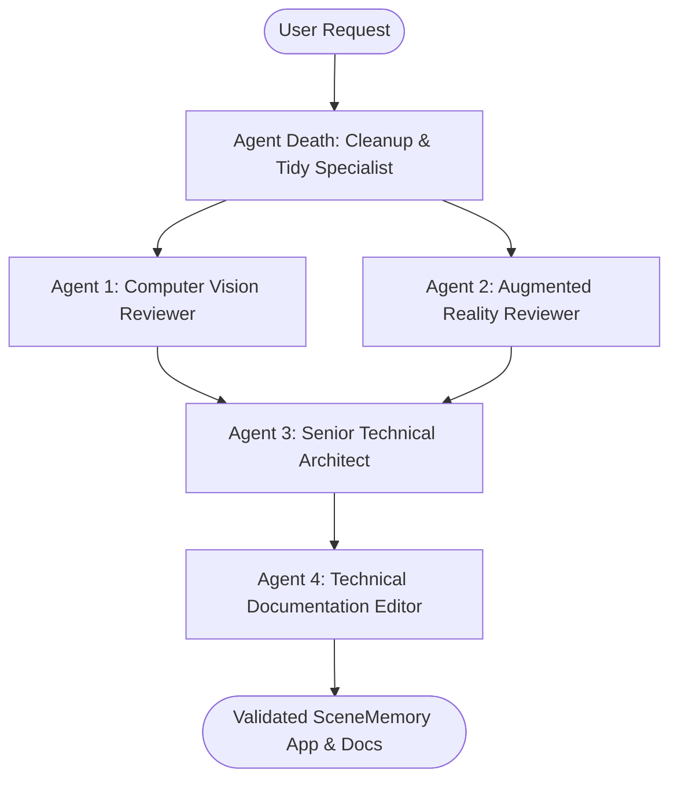

# AGENTS.md — Spatial Proof Lab Agent Governance & Operating Manual

**Project:** Spatial Proof Lab / SceneMemory v1.0.0  
**Target Machine:** Apple Silicon M3 Mac (16 GB RAM)  
**Primary Objective:** Maintain an uncertainty-aware desk camera spatial memory overlay app.

---

## 1. Agent Workstream Architecture & Review Roles

SceneMemory employs a 5-agent multi-review architecture to enforce Clean Architecture, pragmatic performance, documentation integrity, and clean repository hygiene.



### Agent Role Roster & Responsibilities

| Agent Name | Specialty / Domain | Responsibilities | Review Output |
|---|---|---|---|
| **Death** | Repository Cleanup & Tidy Specialist | Destroys dead code, duplicate shims, unused variables, orphan files, and leftover temporary artifacts. Enforces minimal, elegant repository hygiene. | Clean workspace verification |
| **CV Reviewer** | Computer Vision & Inference | Validates model integration (TF.js COCO-SSD & MediaPipe), 3-of-5 hysteresis filter, ambiguity detection, and inference FPS benchmarks. | `docs/reviews/computer_vision_review.md` |
| **AR Reviewer** | Coordinate Systems & Visual Overlay | Validates normalized 2D coordinate mapping, unmirrored/mirrored transforms, canvas letterboxing, viewport resize stability, and camera reset behavior. | `docs/reviews/augmented_reality_review.md` |
| **Senior Architect** | System Integrity & Security | Integrates CV and AR reviews, enforces zero-cost GCP posture, verifies privacy (no frame uploads), and approves Vitest test suites. | `docs/reviews/senior_technical_architect_review.md` |
| **Tech Docs Editor** | Technical Documentation | Authors precise setup guides, architecture diagrams, ADRs, model provenance manifests, and user guides. | `docs/reviews/technical_documentation_editor_review.md` |

---

## 2. Prerequisites & Environment Requirements

- **Operating System:** macOS (Apple Silicon M3 recommended).
- **Node.js:** v20.x or higher (Verified: v26.7.0).
- **Package Manager:** npm v10.x or higher (Verified: v11.19.0).
- **Build Automation:** GNU Make (`make`).
- **Browser:** Google Chrome (Desktop) with WebGL enabled.
- **Hardware:** Built-in FaceTime HD Camera (no phone, headset, or paid account required).

---

## 3. How to Set Up & Run SceneMemory

### Step 1: Clone & Install Dependencies
```bash
git clone file:///Users/reecechallinor/Development/CV
cd CV
npm ci
```

### Step 2: Fetch & Verify Model Assets
```bash
node scripts/fetch-model.mjs
```

### Step 3: Run Static Analysis & Unit Tests
```bash
make lint
make test
```

### Step 4: Launch Local Development Server
```bash
make dev
# Open http://localhost:3000 in Chrome
```

### Step 5: Production Build & Local Server Check
```bash
make build
node server.js
# Open http://localhost:8080/healthz to verify
```

---

## 4. Makefile Automation Targets

```bash
make help       # Display all available CLI commands
make lint       # Run TypeScript type safety static analysis (tsc --noEmit)
make test       # Execute Vitest unit test suite (8 passing tests)
make build      # Compile production Vite bundle to dist/
make docs       # Validate documentation folder structure
make clean      # Clean build caches and temporary dist artifacts
make release    # Verify release readiness for v1.0.0
```

---

## 5. Agent Interaction Protocol & Verification Gates

When invoking subagents or executing autonomous code modifications:
1. **Never Swallow Exceptions:** All async calls must log concrete tracebacks.
2. **Deterministic Verification:** Every code edit MUST be validated via `make test` and `make build`.
3. **Repository Tidy Rule (Agent Death):** Periodically scan for untracked temporary files, unused imports, or duplicate definitions, and purge them immediately.
