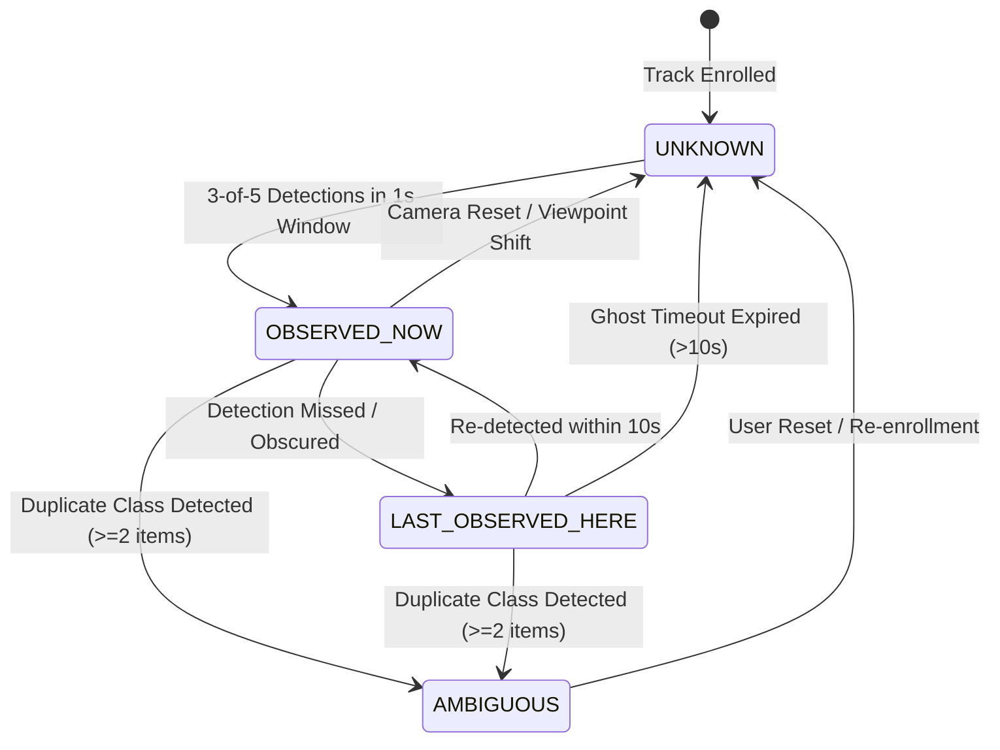

# SceneMemory System Architecture & Data Flow Specification

**Project:** Spatial Proof Lab / SceneMemory v1.0.0  
**Target Platform:** Web Browsers (Chrome Desktop) on M3 Mac  
**Author:** Reece Challinor  

---

## 1. High-Level Architecture Overview

SceneMemory is designed around SOLID Clean Architecture principles, separating camera ingest, perception detectors, temporal hysteresis state machines, canvas rendering, and telemetry metrics into decoupled modules.

```mermaid
graph TD
    subgraph Input_Layer[Media Input Layer]
        Cam[HTML5 getUserMedia Video Stream]
        Replay[ReplayEngine Synthetic Trace]
    end

    subgraph Perception_Layer[Perception Layer]
        DetectorAdapter{Perception Detector Adapter}
        Coco[CocoDetector: TF.js WebGL]
        MediaPipe[PerceptionDetector: MediaPipe WASM]
        DetectorAdapter --> Coco
        DetectorAdapter --> MediaPipe
    end

    subgraph Memory_Layer[Spatial Memory Engine]
        Engine[SpatialMemoryEngine State Machine]
        Hysteresis[3-of-5 Temporal Hysteresis Filter]
        GhostState[Timestamped Ghost Expiry Manager]
        AmbiguityCheck[Class Duplication Ambiguity Latch]
        
        Engine --> Hysteresis
        Engine --> GhostState
        Engine --> AmbiguityCheck
    end

    subgraph Presentation_Layer[Presentation & Telemetry Layer]
        Canvas[CanvasOverlayRenderer 2D HUD]
        Telemetry[Telemetry HUD Metrics Counter]
        NaiveComp[Naive Baseline Comparator]
    end

    Cam --> DetectorAdapter
    Replay --> DetectorAdapter
    DetectorAdapter -->|DetectionResult[]| Engine
    Engine -->|TrackedObject[]| Canvas
    Engine -->|BenchmarkMetrics| Telemetry
    Engine -->|False Assertion Count| NaiveComp
```

---

## 2. Spatial Perception State Machine

Objects tracked by SceneMemory transition through four distinct uncertainty states:



---

## 3. Core Component Contracts

### 1. `ISpatialMemoryEngine` (`src/engine/spatialMemory.ts`)
Consumes raw frame detections and computes updated `TrackedObject[]` tracks and `BenchmarkMetrics`. Enforces:
- **3-of-5 Temporal Hysteresis:** Prevents single-frame detection noise from creating false anchors.
- **Ghost State Decay:** Fades bounding box opacity over a configurable timeout (default: 10 seconds).
- **Ambiguity Latch:** Invalidates tracks when multiple instances of the same enrolled class appear.
- **Naive Baseline Benchmark:** Computes false current-location assertions made by naive systems that never expire missing objects.

### 2. `CanvasOverlayRenderer` (`src/ui/canvasOverlay.ts`)
Renders high-FPS 2D HUD graphics directly on an overlay canvas:
- **Observed Now:** Green solid reticle with corner notches and confidence score chip.
- **Last Observed Here:** Violet/amber dashed ghost box with radar pulse animation and countdown timer (`Last seen 4.2s ago`).
- **Ambiguous:** Yellow warning hashes with cautionary banner (`⚠️ AMBIGUOUS`).
- **Naive Baseline Overlay:** Red warning outline illustrating naive model false claims.

---

## 4. Coordinate Transformation & Viewport Resizing

Bounding boxes are tracked internally as normalized coordinates `[originX, originY, width, height]` relative to the 640x360 / 640x480 video frame.

When rendering:
1. `scaleX = canvasWidth / videoWidth`
2. `scaleY = canvasHeight / videoHeight`
3. `renderX = originX * scaleX`
4. `renderY = originY * scaleY`

If unmirrored mode is active, boxes render directly. If mirrored mode is toggled, X-coordinates flip automatically via `renderX' = canvasWidth - (renderX + renderWidth)`.
